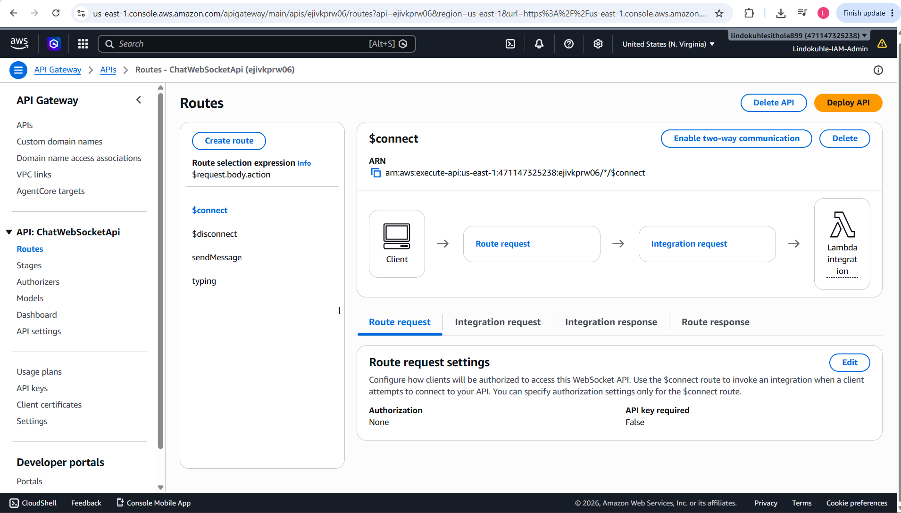
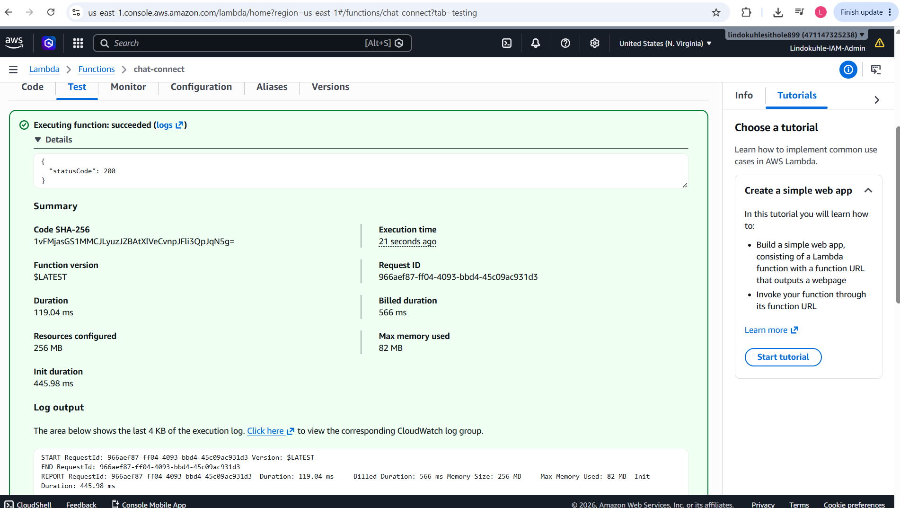
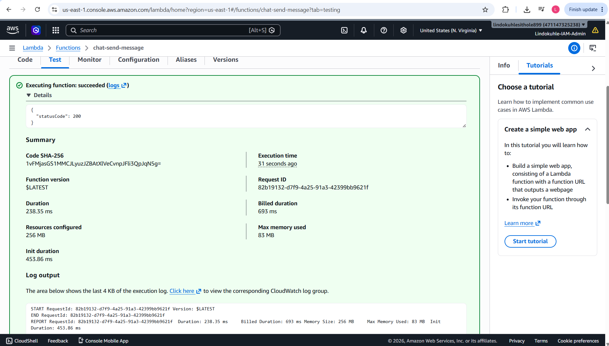
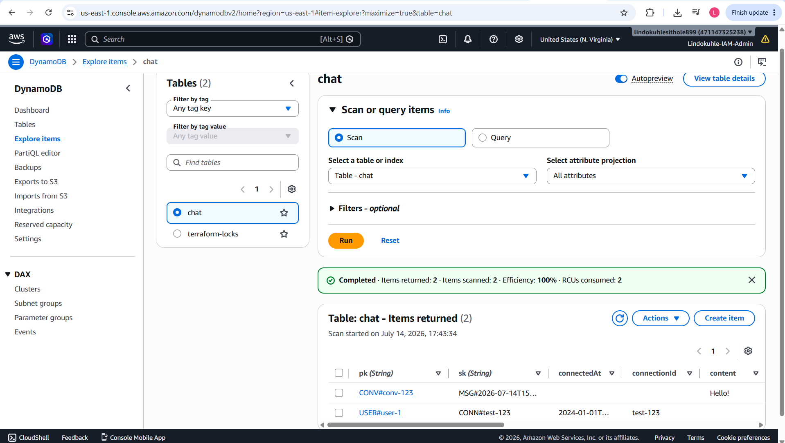
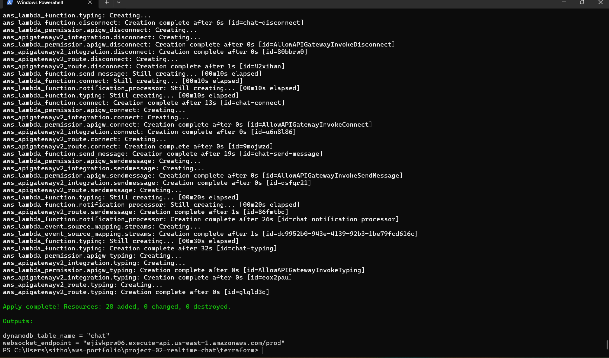
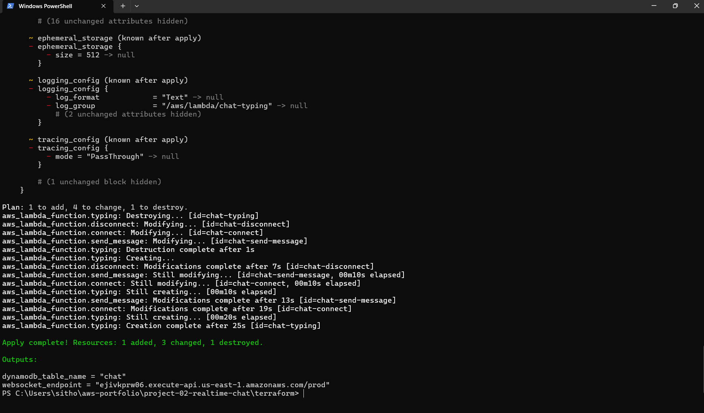
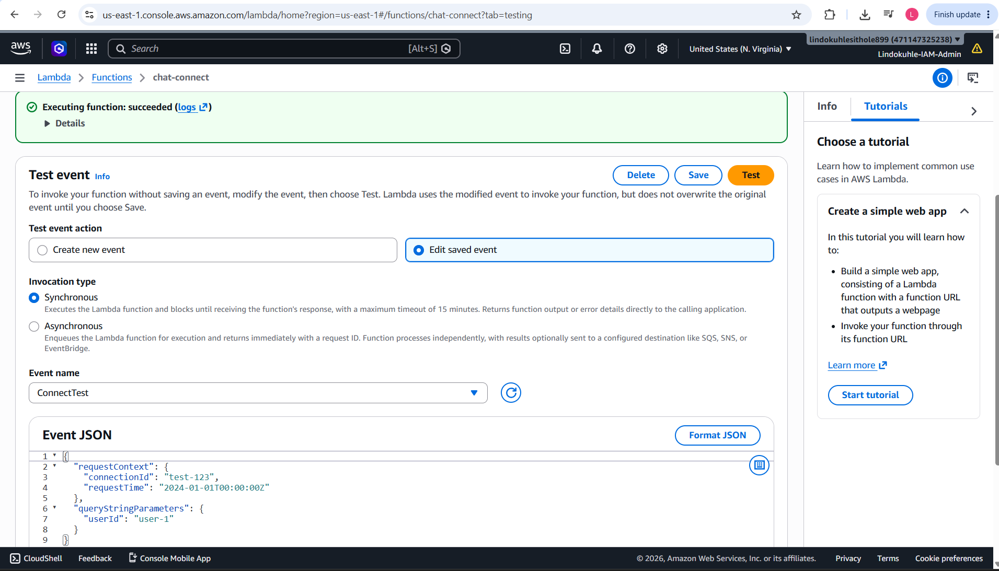
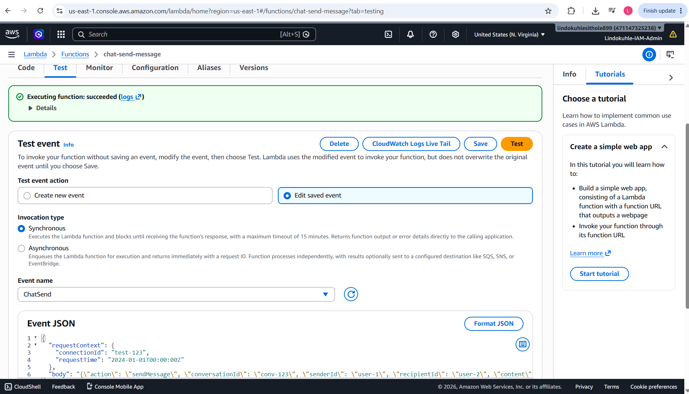
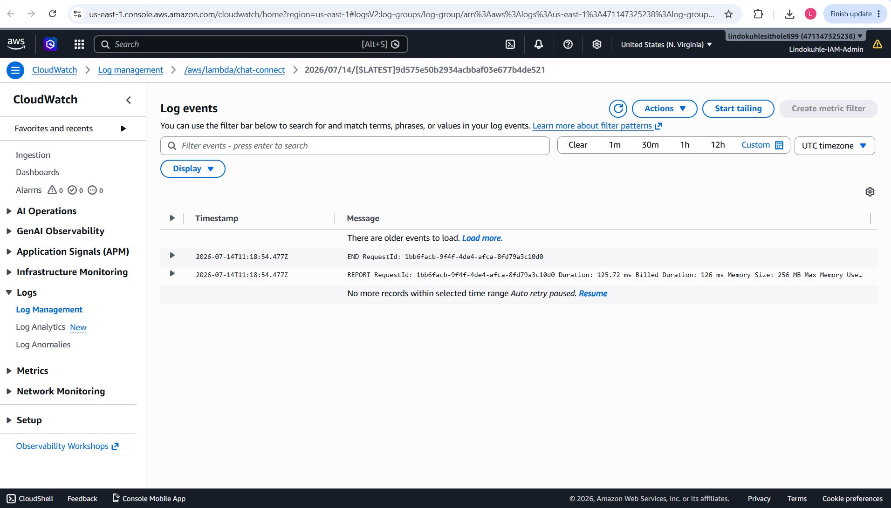
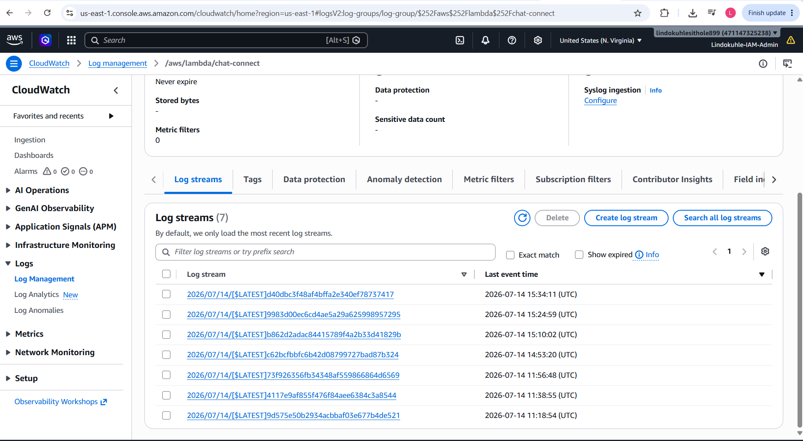

<h1 align="center">Real-Time Chat Backend with WebSockets & DynamoDB Streams</h1>


## Table of Contents

- [Overview](#overview)
- [Architecture](#architecture)
- [What I Built](#what-i-built)
- [Technology Stack](#technology-stack)
- [Project Structure](#project-structure)
- [Deployment](#deployment)
- [Testing](#testing)
- [Observability](#observability)
- [What I Learned](#what-i-learned)
- [Cleanup](#cleanup)
- [Author](#author)

---

## Overview

I built a real-time chat backend using WebSocket APIs on AWS. The system handles persistent bidirectional connections, message delivery, typing indicators, and connection management — all without a single server running 24/7. Everything is serverless, auto-scaling, and pay-per-use.

**What this project demonstrates:**
- WebSocket API design with API Gateway (not REST — persistent connections)
- Serverless event handling with 5 Lambda functions
- Single-table DynamoDB design for connections, messages, and conversations
- DynamoDB Streams for real-time offline notification processing
- Terraform IaC with WebSocket-specific API Gateway v2 resources
- Connection state management at scale

**Timeline:** Multiple iterations. The initial deploy created 28 resources and took several minutes. Then I iteratively refined the Lambda functions, adding the typing indicator and fixing IAM permissions for API Gateway to invoke Lambda.

---

## Architecture


**WebSocket vs REST:** This is the key difference. REST APIs are stateless — each request is independent. WebSocket APIs maintain a persistent connection. When a client connects, API Gateway assigns a `connectionId`. All subsequent messages use that same connection. This is what enables real-time bidirectional communication.

**Single-table design:** I used one DynamoDB table (`chat`) with a composite key pattern. The partition key (`pk`) identifies the entity type (conversation, user), and the sort key (`sk`) identifies the specific item (message, connection). This reduces operational overhead and query complexity.

---

## What I Built

### API Gateway WebSocket API — 4 Routes

I created a WebSocket API with 4 routes, each mapped to its own Lambda function:

| Route | Lambda Function | Purpose |
|-------|----------------|---------|
| `$connect` | `chat-connect` | Client opens WebSocket connection, store `connectionId` in DynamoDB |
| `$disconnect` | `chat-disconnect` | Client closes connection, remove `connectionId` from DynamoDB |
| `sendMessage` | `chat-send-message` | Client sends a message, save to DynamoDB, broadcast to recipient |
| `typing` | `chat-typing` | Client is typing, show "typing..." indicator to recipient |



The route selection expression is `$request.body.action` — API Gateway inspects the `action` field in the incoming JSON to determine which route to invoke.

### Lambda Functions — 5 Functions

I built 5 Lambda functions in Python 3.11:

**1. chat-connect** — Handles new WebSocket connections

```python
import json
import boto3
import os

dynamodb = boto3.resource('dynamodb')
table = dynamodb.Table(os.environ['TABLE_NAME'])

def lambda_handler(event, context):
    connection_id = event['requestContext']['connectionId']
    user_id = event.get('queryStringParameters', {}).get('userId', 'anonymous')
    
    table.put_item(Item={
        'pk': f'USER#{user_id}',
        'sk': f'CONN#{connection_id}',
        'connectionId': connection_id,
        'userId': user_id,
        'connectedAt': event['requestContext']['requestTime']
    })
    
    return {'statusCode': 200}
```



**2. chat-send-message** — Handles message delivery

This is the most complex function. It:
1. Parses the incoming message from the WebSocket event
2. Saves the message to DynamoDB with conversation context
3. Looks up the recipient's `connectionId` from DynamoDB
4. Uses the API Gateway Management API to post the message directly to the recipient's WebSocket connection



**3. chat-typing** — Typing indicator

When a user starts typing, this function broadcasts a `typing` event to the recipient so they see "User is typing..."

**4. chat-disconnect** — Connection cleanup

Removes the connection record from DynamoDB when a client disconnects.

**5. chat-notification-processor** — DynamoDB Streams consumer

Processes DynamoDB Stream records to log offline messages for users who weren't connected when the message was sent.

### DynamoDB — Single Table Design

I used a single table called `chat` with the following access patterns:

| pk | sk | Attributes | Access Pattern |
|----|-----|-----------|---------------|
| `USER#<userId>` | `CONN#<connectionId>` | connectionId, connectedAt | Find connections by user |
| `CONV#<convId>` | `MSG#<timestamp>` | content, senderId, recipientId | Get messages in conversation |
| `USER#<userId>` | `META#profile` | username, status | User profile |



The scan returned 2 items with 100% efficiency — both items were returned with only 2 RCUs consumed. The single-table design means one query can fetch a conversation's messages, a user's connections, and their profile without joining tables.

---

## Technology Stack

| Service | Purpose |
|---------|---------|
| **Terraform** | Infrastructure as Code with API Gateway v2 resources |
| **API Gateway (WebSocket)** | Persistent bidirectional connections with route-based message routing |
| **AWS Lambda** | 5 serverless functions handling connect, disconnect, send, type, and notifications |
| **Amazon DynamoDB** | Single-table design for connections, messages, and conversations |
| **DynamoDB Streams** | Real-time event capture for offline notification processing |
| **CloudWatch** | Logging and monitoring for all Lambda functions |

---

## Project Structure

```
project-02-realtime-chat/
├── terraform/
│   ├── main.tf              # WebSocket API, Lambda functions, DynamoDB table
│   ├── variables.tf         # Configurable inputs
│   ├── outputs.tf           # WebSocket endpoint URL
│   └── terraform.tfvars     # Environment config
├── src/
│   ├── connect/
│   │   ├── handler.py       # $connect route handler
│   │   └── requirements.txt
│   ├── disconnect/
│   │   ├── handler.py       # $disconnect route handler
│   │   └── requirements.txt
│   ├── send_message/
│   │   ├── handler.py       # sendMessage route handler
│   │   └── requirements.txt
│   ├── typing/
│   │   ├── handler.py       # typing route handler
│   │   └── requirements.txt
│   └── notification_processor/
│       ├── handler.py       # DynamoDB Streams consumer
│       └── requirements.txt
├── Makefile
└── README.md
```

---

## Deployment

### Prerequisites

- AWS CLI configured (`aws configure`)
- Terraform >= 1.0
- Python 3.11+ (for local testing)
- IAM permissions for: Lambda, API Gateway v2, DynamoDB, CloudWatch, IAM

### Deploy

```bash
cd terraform
terraform init
terraform plan
terraform apply -auto-approve
```

**Initial deployment created 28 resources** and output the WebSocket endpoint:



```
Apply complete! Resources: 28 added, 0 changed, 0 destroyed.

Outputs:
dynamodb_table_name = "chat"
websocket_endpoint = "ejivkprw06.execute-api.us-east-1.amazonaws.com/prod"
```

After iterative development (adding typing indicator, fixing permissions):



```
Apply complete! Resources: 1 added, 3 changed, 1 destroyed.

Outputs:
dynamodb_table_name = "chat"
websocket_endpoint = "ejivkprw06.execute-api.us-east-1.amazonaws.com/prod"
```

---

## Testing

### Lambda Console Testing

I tested each Lambda function individually using the AWS Console before integrating with the WebSocket API.

**chat-connect test** with a ConnectTest event:



**chat-send-message test** with a ChatSend event:



### WebSocket Testing with wscat

```bash
# Install wscat
npm install -g wscat

# Connect to the WebSocket endpoint
wscat -c wss://ejivkprw06.execute-api.us-east-1.amazonaws.com/prod

# Send a message
> {"action": "sendMessage", "conversationId": "conv-123", "senderId": "user-1", "recipientId": "user-2", "content": "Hello!"}

# Typing indicator
> {"action": "typing", "conversationId": "conv-123", "senderId": "user-1"}
```

### Verify Data in DynamoDB

```bash
# Scan the chat table
aws dynamodb scan --table-name chat --limit 10
```

The table contains both conversation messages (`CONV#<id>`) and user connections (`USER#<id>`):

```json
{
  "Items": [
    {
      "pk": "CONV#conv-123",
      "sk": "MSG#2026-07-14T15...",
      "content": "Hello!",
      "senderId": "user-1",
      "recipientId": "user-2"
    },
    {
      "pk": "USER#user-1",
      "sk": "CONN#test-123",
      "connectionId": "test-123",
      "connectedAt": "2024-01-01T..."
    }
  ]
}
```

---

## Observability

### CloudWatch Logs

Each Lambda function writes execution logs to its own CloudWatch log group. I can trace the full lifecycle of a WebSocket connection — from `$connect` through `sendMessage` to `$disconnect` — by following the log streams.



### CloudWatch Log Streams

The `chat-connect` function alone generated 7 log streams during testing, showing active connection handling:



### Key Metrics I Monitor

| Metric | Source | Alert Threshold |
|--------|--------|----------------|
| Lambda errors | CloudWatch | > 0 in 5 minutes |
| Connection count | DynamoDB item count | N/A (informational) |
| Message latency | CloudWatch Logs duration | > 500ms |
| API Gateway 4xx/5xx | CloudWatch | > 5% of requests |

---

## What I Learned

**WebSocket APIs are fundamentally different from REST.** With REST, each request is independent. With WebSockets, you manage connection state. The `connectionId` becomes your session identifier, and you store it in DynamoDB to route messages to specific clients. This mental model shift took time to internalize.

**API Gateway v2 has different Terraform resources than v1.** REST APIs use `aws_api_gateway_rest_api`. WebSocket APIs use `aws_apigatewayv2_api`. The integration, route, and deployment resources are all different. I initially mixed v1 and v2 resources and got confusing errors.

**The Management API is how you send messages back to clients.** To push a message to a connected client, you don't use the WebSocket URL — you use the `@connections` endpoint with the recipient's `connectionId`. This requires the API Gateway to have `execute-api:Invoke` permission on itself, which is a circular IAM dependency that needs careful handling.

**Single-table design is powerful but requires planning.** Every access pattern must be designed upfront because you're sharing one table. The composite key pattern (`pk` for entity type, `sk` for specific item) works well, but you need to be disciplined about naming conventions.

**IAM permissions for WebSocket APIs are complex.** API Gateway needs permission to invoke Lambda. Lambda needs permission to call the Management API (`@connections`). DynamoDB needs permission to trigger Streams. Each of these is a separate IAM policy, and getting the ARN patterns right for API Gateway v2 took several attempts.

---

## Cleanup

```bash
cd terraform
terraform destroy -auto-approve
```

**Warning:** This deletes all AWS resources including data in the DynamoDB table.

---

## Roadmap

- [ ] Add user authentication with Cognito
- [ ] Implement message encryption with KMS
- [ ] Add media upload (images, files) with S3 presigned URLs
- [ ] Build a React frontend for the chat interface
- [ ] Add read receipts and message status tracking
- [ ] Implement group conversations
- [ ] Add CI/CD pipeline with GitHub Actions

---

## Author

**Lindokuhle Sithole** - *Cloud Engineer | Cloud DevOps Engineer | Cloud Security Specialist*

Based in Bremen, Germany. BSc Mathematical Science from the University of the Witwatersrand. 5x AWS Certified (Solutions Architect Professional, Security Specialty, CloudOps Engineer Associate, Solutions Architect Associate, Cloud Practitioner) plus CompTIA Security+.

- **LinkedIn:** [linkedin.com/in/lindokuhle-sithole-bb701b19a](https://www.linkedin.com/in/lindokuhle-sithole-bb701b19a)
- **GitHub:** [github.com/lindokuhlesithole](https://github.com/lindokuhlesithole)
- **Email:** sitholelindokuhle371@gmail.com

---
